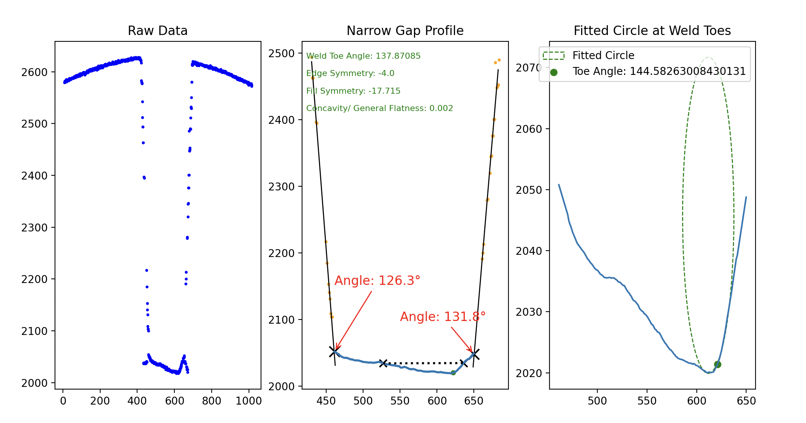
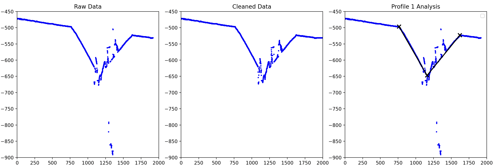
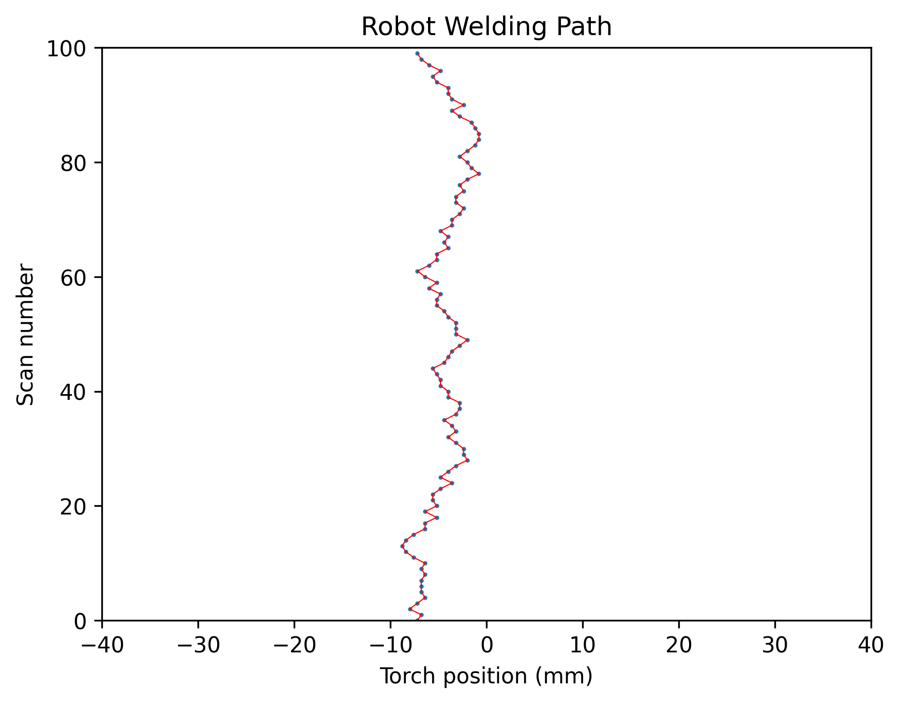
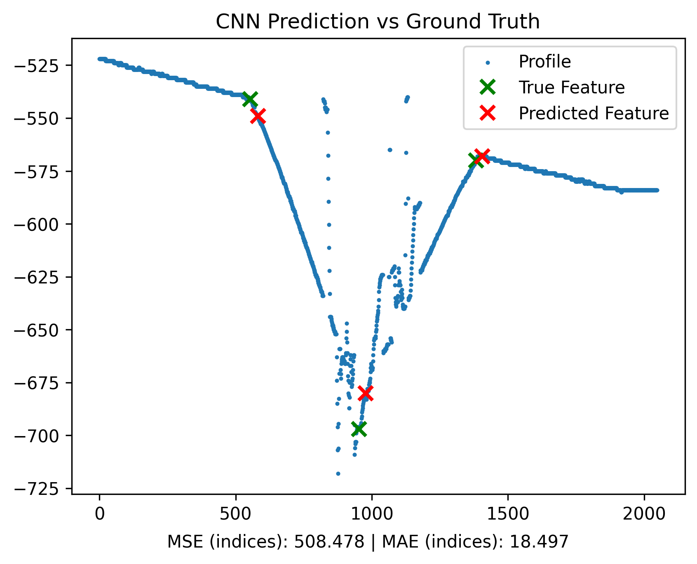
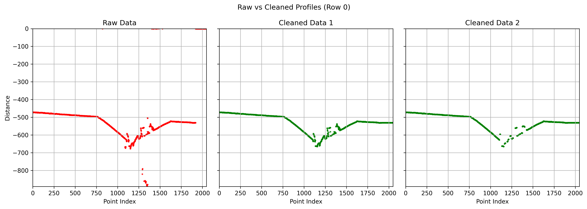
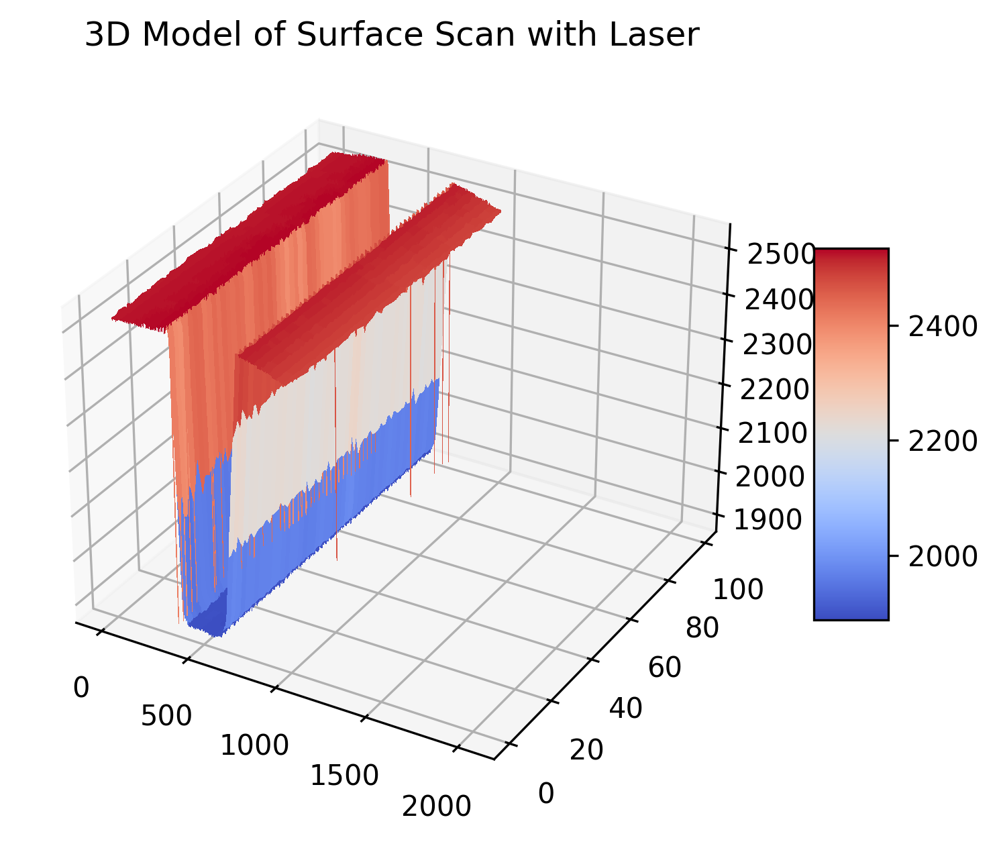
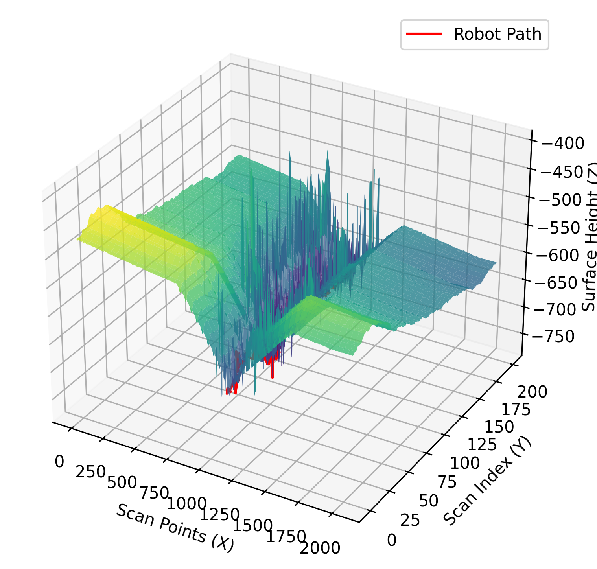
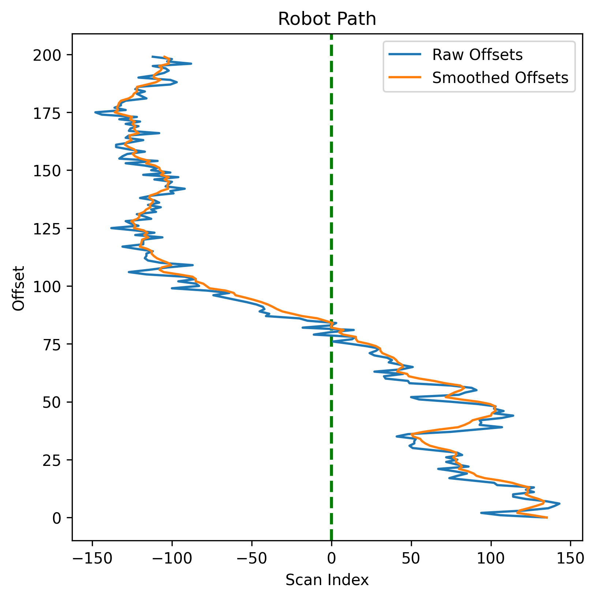
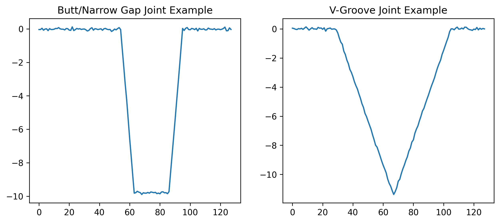

# Robotic Automation (Manufacturing) Research

## Overview

A collection of data science programs designed to aid in the research of mathematical modelling, computer vision, and deep learning strategies for various robotics applications, notably applications in automated robotic welding.

## Program Summaries and Outputs

**Scan Analysis** - geometric feature analysis of laser distance profiles of various welding joints (currently V Grooves and Narrow Gaps). Uses data cleaning and (RANSAC) regression methods for accurately finding edges and corners within noisy signal data with significant numbers of grouped outliers (usually a product of laser lines on shiny, reflective surfaces). Features extracted include: welding edges; surface angles; suggested weld capping pass locations; weld-toe angles. *Note: scan_analysis.py does not include full code for these features due to potential implementation for sensitive projects.*

**WeldSeamTracking.py** - Simple python implementation for weld seam tracking using a laser distance sensor for seam searching.

**laser_robot_calibration.py** - Program for calibrating a laser distance sensor with a (FANUC) robot Tool Centre Point: finds the translation from an (x,y) sensor coordinate to an (x,y,z,w,p,r) robot coordinate. Uses linear algebra (rotational matrix calculations) and a gradient descent algorithm for optimisation of the sensor frame.

**CNN_feature_extraction.py** - Pytorch framework for geometric feature extraction from 1 dimensional shape data (originally for laser distance values to find surface features). Utilises 1D convolution layers and model training via training and validation sets. Includes model evaluation via error calculation on a testing set as well as graphically via plotting predictions using matplotlib.

**track_flow.py** - Method of tracking the movement distance, direction and speed of any surface (including essentially featureless surfaces) using OpenCV and ORB feature detection for real-time industrial camera feed (originally prototyped using an IDS camera).

**data_preprocessing.py** - Research into methods of cleaning noisy signal data with significant numbers of outliers and dense clusters of outliers - originally developed for research into laser distance data for particularly reflective welding surfaces.

**3D_surface_modelling.py** - program that takes a system of laser scans in csv form and outputs a full 3D model, ready for 3D analysis.

**weld_path_3D.py** - Program that takes a 3D surface model from a csv file of continuous laser scans, and performs feature extraction to get the suggested weld path long that surface.

**generate_synthetic_data.py** - program that generates synthetic laser profiles of weld joints as a tool for additional data generation for AI/ML model training and testing.

**sensor_robot_transform.py** - program that takes the calibrated sensor frame of a laser distance sensor attached to a robot arm and converts any point seen by the laser into the robot's coordinate frame.